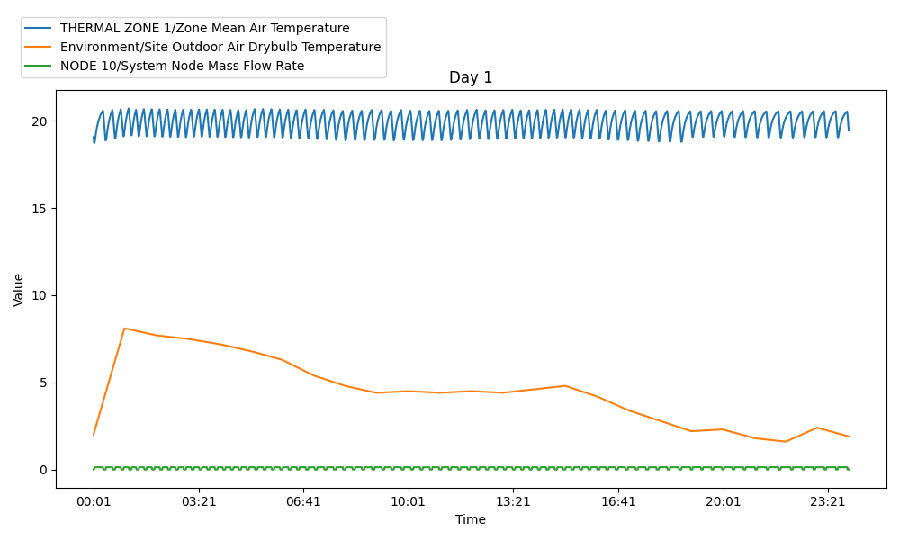
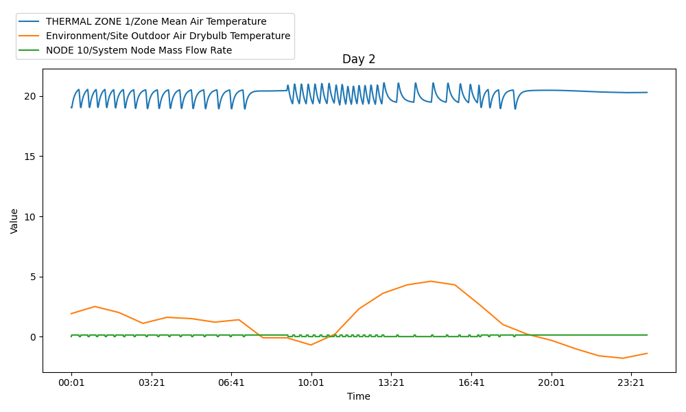
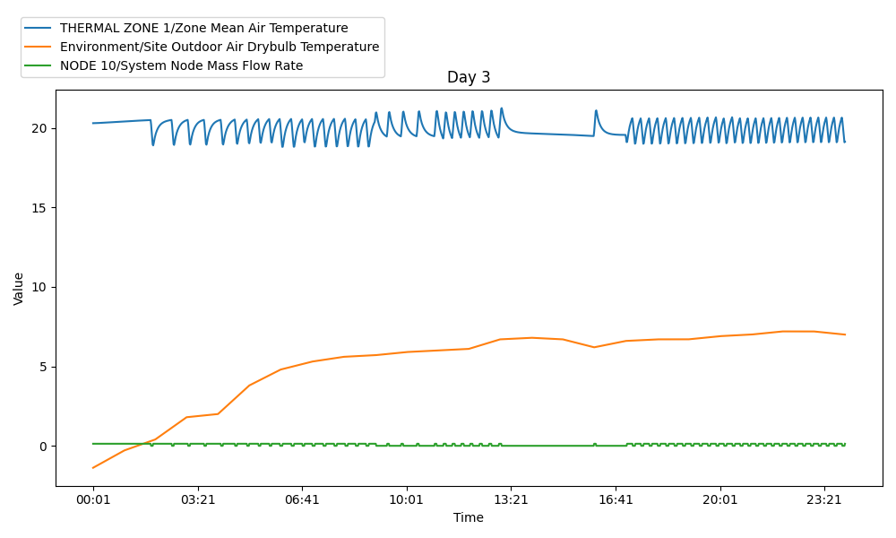
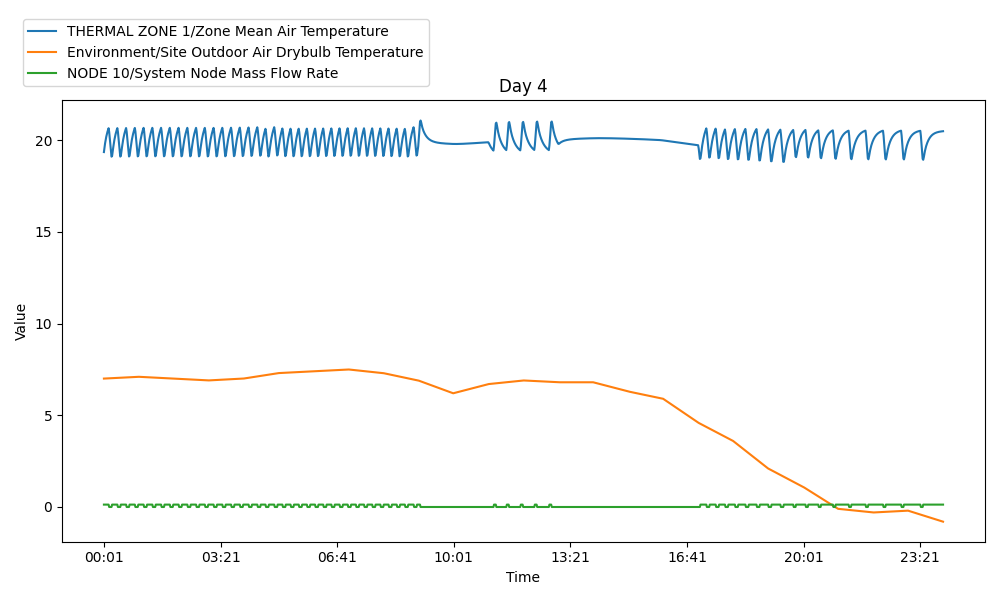
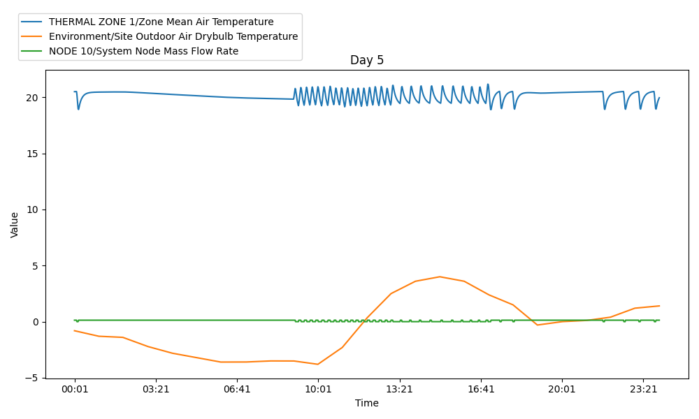
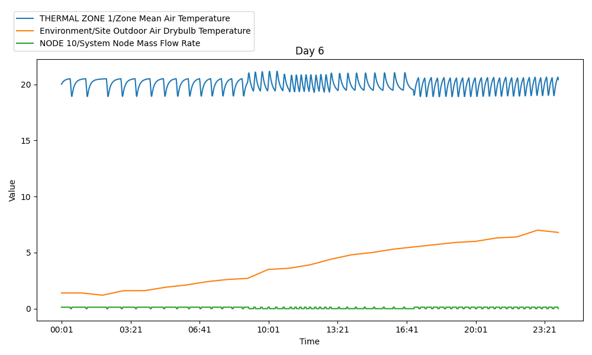
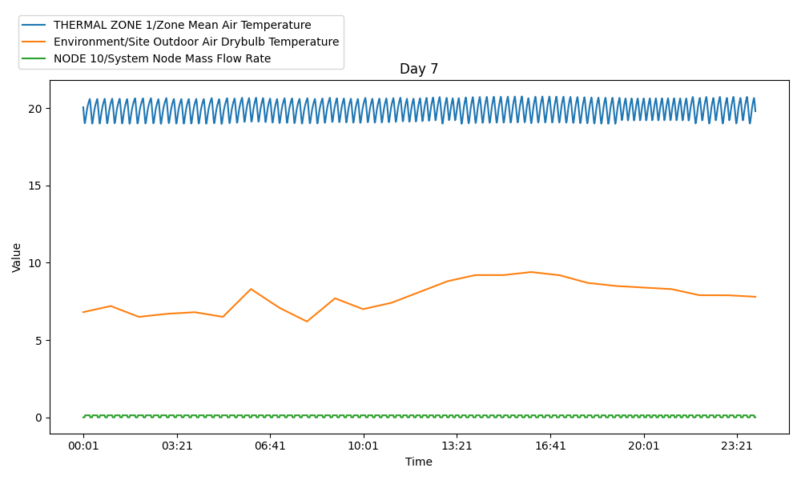

## 4) Dentre as variáveis abaixo (ver tabela ReportDataDictionary), faça um ranqueamento das que possuem maior correção com a temperatura da zona 1 (THERMAL ZONE 1 / Zone Mean Air Temperature). Quais destas variáveis seriam importantes em um modelo preditivo da temperatura da zona 1?

Primeiro passo será carregado todo o contéudo das tabelas `ReportDataDictionary` e `ReportData` para um `DataFrame` em `pandas`:
```python
import pandas as pd
import sqlite3

conn = sqlite3.connect('eplusout.sql')
report_data_dict = pd.read_sql_query("SELECT * FROM ReportDataDictionary", conn)
report_data = pd.read_sql_query("SELECT * FROM ReportData", conn)
```
---
A seguir é definido uma lista de pares de valores que serão usados para filtrar os dados, após, é filtrado o `DataFrame` `report_data_dict` para incluir apenas as linhas as quais os valores nas colunas `KeyValue` e `Name` estão na lista de pares. Isso fará ignorar os outros tipos de variáveis e considerar apenas aquelas solicitadas.

```python
pairs = [
    ('THERMAL ZONE 1', 'Zone Mean Air Temperature'),
    ('Environment', 'Site Outdoor Air Drybulb Temperature'),
    ('Environment', 'Site Wind Speed'),
    ('Environment', 'Site Wind Direction'),
    ('Environment', 'Site Horizontal Infrared Radiation Rate per Area'),
    ('Environment', 'Site Diffuse Solar Radiation Rate per Area'),
    ('Environment', 'Site Direct Solar Radiation Rate per Area'),
    ('OFFICE WORK OCC', 'Schedule Value'),
    ('NODE 10', 'System Node Mass Flow Rate'),
]

filtered_dict = report_data_dict[report_data_dict[['KeyValue', 'Name']]
    .apply(tuple, axis=1)
    .isin(pairs)]
```

---
O código a seguir renomeia a coluna `Name` para considerar o campo `KeyValue`, por exemplo, `{{KeyValue}}\{{Name}}` `THERMAL ZONE 1\Zone Mean Air Temperature`. Após é criado outro DF `filtered_dict` considerando apenas as colunas `ReportDataDictionaryIndex` e `Name` com o objetivo de executar uma junção (`pd.merge`) com o df `report_data` pela coluna `ReportDataDictionaryIndex`. A última linh reorganiza `merged` para ter `TimeIndex` como índice e `Name` como colunas. Os valores são preenchidos com os dados da coluna `Value`.


```python
filtered_dict.loc[:, 'Name'] = filtered_dict['KeyValue'] + '/' + filtered_dict['Name']
filtered_dict = filtered_dict[['ReportDataDictionaryIndex', 'Name']]
merged = pd.merge(report_data, filtered_dict, on='ReportDataDictionaryIndex')
pivot = merged.pivot(index='TimeIndex', columns='Name', values='Value')
```

---
Podemos ver as informações do novo `DataFrame` `pivot` com o comando `.info()`, esse será o `DataFrame` padrão utilizado para questão 5 e 6, pois sua manipulação é simplificada devido as suas colunas serem mapeadas para uma variável.

```bash
Data columns (total 9 columns):
 #   Column                                                        Non-Null Count  Dtype  
---  ------                                                        --------------  -----  
 0   Environment/Site Diffuse Solar Radiation Rate per Area        10080 non-null  float64
 1   Environment/Site Direct Solar Radiation Rate per Area         10080 non-null  float64
 2   Environment/Site Horizontal Infrared Radiation Rate per Area  10080 non-null  float64
 3   Environment/Site Outdoor Air Drybulb Temperature              10080 non-null  float64
 4   Environment/Site Wind Direction                               10080 non-null  float64
 5   Environment/Site Wind Speed                                   10080 non-null  float64
 6   NODE 10/System Node Mass Flow Rate                            10080 non-null  float64
 7   OFFICE WORK OCC/Schedule Value                                10080 non-null  float64
 8   THERMAL ZONE 1/Zone Mean Air Temperature                      10080 non-null  float64
```

---
A seguir é calculada a correlação de Pearson da variável `THERMAL ZONE 1/Zone Mean Air Temperature` com as solicitadas no enúnciado. 

```python
correlations = pivot.corrwith(pivot['THERMAL ZONE 1/Zone Mean Air Temperature'])
sorted = correlations.abs().sort_values(ascending=False)
print(sorted)
```

---
Foi observado que as variáveis têm uma correlação relativamente baixa com `THERMAL ZONE 1/Zone Mean Air Temperature`, sendo a mais forte `NODE 10/System Node Mass Flow Rate` com um valor de `0.259462`. No entanto, todas as variáveis a partir de `Environment/Site Wind Speed` em diante poderiam ser consideradas importantes em um modelo preditivo para a temperatura da zona, apesar de suas correlações mais baixas.

```bash
NODE 10/System Node Mass Flow Rate                              0.259462
Environment/Site Outdoor Air Drybulb Temperature                0.191403
Environment/Site Horizontal Infrared Radiation Rate per Area    0.181813
Environment/Site Wind Speed                                     0.144100
Environment/Site Wind Direction                                 0.027652
Environment/Site Direct Solar Radiation Rate per Area           0.016991
Environment/Site Diffuse Solar Radiation Rate per Area          0.011274
OFFICE WORK OCC/Schedule Value                                  0.010307
```

## 5) Faça gráficos para cada dia. Qual a relação entre a temperatura externa e a temperatura da zona? Qual a relação entre o Fluxo de Massa e a temperatura da zona? Qual a relação entre o Fluxo de Massa e a temperatura externa? 

Carrega as tabelas para `DataFrames`, para o DF `time` é selecionado as colunas `TimeIndex', 'Day', 'Hour', 'Minute', 'SimulationDays'`:

```python
import pandas as pd
import sqlite3
import matplotlib.pyplot as plt

conn = sqlite3.connect('eplusout.sql')
report_data_dict = pd.read_sql_query("SELECT * FROM ReportDataDictionary", conn)
report_data = pd.read_sql_query("SELECT * FROM ReportData", conn)
time = pd.read_sql_query("SELECT * FROM Time", conn)
time = time[['TimeIndex', 'Day', 'Hour', 'Minute', 'SimulationDays']]
```

---
A seguir é filtrado o DataFrame `report_data_dict` para incluir apenas as linhas que correspondem as variáveis solicitadas no exercício. Depois disso, ele concatena as colunas `KeyValue` e `Name` para formar uma única coluna `Name`, após é reduzido o `DataFrame` para incluir apenas as colunas `ReportDataDictionaryIndex` e `Name`, que são as informações necessárias para a análise posterior.
```python
pairs = [
    ('THERMAL ZONE 1', 'Zone Mean Air Temperature'),
    ('Environment', 'Site Outdoor Air Drybulb Temperature'),
    ('NODE 10', 'System Node Mass Flow Rate'),
]

filtered_dict = report_data_dict[report_data_dict[['KeyValue', 'Name']]
    .apply(tuple, axis=1)
    .isin(pairs)]

filtered_dict.loc[:, 'Name'] = filtered_dict['KeyValue'] + '/' + filtered_dict['Name']
filtered_dict = filtered_dict[['ReportDataDictionaryIndex', 'Name']]
```


---
O próximo trecho de código está realizando a junção dos dados filtrados com os dados originais e os dados de tempo, reestruturando-os em um formato conveniente para análise, e preparando-os para iteração por dia.

1. Primeiro, os DF `report_data` e `filtered_dict` são unidos com base na coluna `ReportDataDictionaryIndex`, e então junta o resultado com o DataFrame `time` com base na coluna `TimeIndex`.
2. Em seguida, ele reestrutura o DataFrame resultante em um formato de tabela `pivot`, construindo a tupla {`TimeIndex`, `Hour`, `Minute`, `Day`} como índice', `Name` se transformarão nas colunas e `Value` nos valores. Assim como na questão 5.
3. Após é criada uma nova coluna `Time` que combina as colunas `Hour` e `Minute` em um formato de tempo, ordena o DF pelo `TimeIndex`, e redefine `Time` como o índice do DF.
4. Finalmente, é agrupado o DF por 'Day' e cria um iterador para esses grupos, permitindo a iteração através dos dados um dia de cada vez.
```python
merged = pd.merge(report_data, filtered_dict, on='ReportDataDictionaryIndex')
merged = pd.merge(merged, time, on='TimeIndex')

pivot = merged.pivot(index=['TimeIndex', 'Hour', 'Minute', 'Day'], columns='Name', values='Value')
pivot['Time'] = pivot.index.get_level_values('Hour').astype(str).str.zfill(2) + ':' + pivot.index.get_level_values('Minute').astype(str).str.zfill(2)
pivot = pivot.sort_index(level='TimeIndex')
pivot.reset_index(inplace=True)
pivot.set_index('Time', inplace=True)

groups = pivot.groupby('Day')
group_iterator = iter(groups)
```

---
O próximo trecho de código está gerando e salvando gráficos para cada dia de dados. Ele faz isso iterando sobre os grupos de dados por dia que foram preparados anteriormente. No total serão gerados 7 gráficos um para cada dia de análise que contem o banco de dados fornecido.

```python
for i in range(7):
    figure, axis = plt.subplots(sharex='all', sharey='all', figsize=(10, 6))

    day, group = next(group_iterator)

    for key_value, value in pairs:
        column = key_value + '/' + value
        group[column].plot(ax=axis, label=column)

    axis.set_title(f'Day {day}')
    axis.set_xlabel('Time')
    axis.set_ylabel('Value')
    plt.legend(loc='upper left', bbox_to_anchor=(-0.05, 1.2))
    plt.tight_layout()
    plt.savefig(f'graph_day_{day}.png')
```

---
O resultado do código anterior resulta na geração de 7 gráficos contendo informação das varições de `THERMAL ZONE 1\Zone Mean Air Temperature`, `Environment\Site Outdoor Air Drybulb Temperature`,  `NODE 10\System Node Mass Flow Rate` ao longo dos dias.

<table>
  <tr>
    <td></td>
    <td></td>
    <td></td>
  </tr>
  <tr>
    <td></td>
    <td></td>
    <td></td>
  </tr>
  <tr>
    <td></td>
  </tr>
</table>

1. Temperatura externa Vs. Temperatura da Zona: há uma variação constante da temperatura da zona, percebe-se que há um mecanismo de controle de temperatura nessa área, logo, mesmo com variações grandes na temperatura externa a temperatura da zona permanece estável.
2. Fluxo de Massa Vs. Temperatura da zona: Quando há variação na temperatura da zona, também há variação do fluxo de massa. O mesmo é percebido quando a temperatura da zona permanece estável, o fluxo de massa também estabiliza.
3. Fluxo de Massa Vs. temperatura externa: Mesmo com variações na temperatura externa o fluxo de massa se mantém constante.
